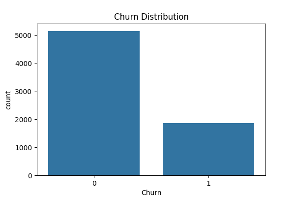

# Customer Churn Prediction

This project aims to predict whether a customer will churn (i.e., discontinue a service) using machine learning models based on customer behavior, demographics, and service usage. The insights can help businesses retain customers by identifying risk factors and taking proactive steps.

# Project Overview

- Objective: Predict customer churn and identify key churn factors
- Dataset: [Telco Customer Churn Dataset](https://www.kaggle.com/datasets/blastchar/telco-customer-churn)
- Tech Stack: Python, Pandas, Scikit-learn, Seaborn, Matplotlib
- Output: Churn predictions, evaluation report, visualizations, and trained model saved in "outputs/" folder

# Libraries Used

- "pandas"
- "numpy"
- "seaborn"
- "matplotlib"
- "scikit-learn"
- "joblib"

# Install all dependencies:

pip install -r requirements.txt

# Key Insights

- Customers with month-to-month contracts, electronic check payment, or without tech support are more likely to churn.
- Tenure, monthly charges, and service features significantly influence churn likelihood.
- The trained model achieves high precision and recall, helping reduce customer loss.

# Sample Visualizations

# Churn Distribution  

# How to Run This Project

1. Clone the repository:

   git clone https://github.com/your-username/Customer-Churn-Prediction.git
   cd Customer-Churn-Prediction

2. Install dependencies:
   
   pip install -r requirements.txt
   
3. Run the prediction script:
   
   python churn_prediction.py

4. View the results in the `outputs/` folder.

# Future Improvements

- Add ensemble models and hyperparameter tuning
- Deploy the model using Streamlit or Flask
- Integrate customer retention recommendations

# Author
Haroon Bashi
[GitHub](https://github.com/haroonbashi2514) | [LinkedIn](https://www.linkedin.com/in/haroon-bashi-3aa683215)

⭐️ Star this repo if you found it helpful!
